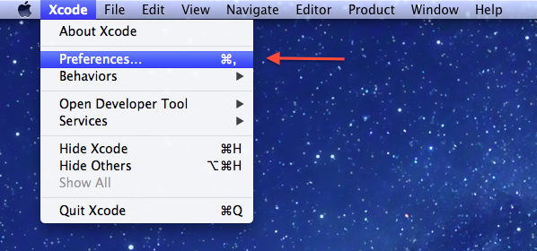

# CS10 Installation #

##Install Developer Tools + Command Line Tools:##

###on Lion (10.7.x) or MountainLion (10.8.x):###

1. Download and install Xcode via the App Store: [xcode](http://itunes.apple.com/us/app/xcode)
2. Open the Xcode app (/Applications/Xcode.app)
3. Go to Preferences: 
4. Make sure Command Line Tools are installed:  

###Snow Leopard (ideally you should really upgrade to 10.7 at the least but will work):###

1. Download and Install:  [xcode_4.2_for_snow_leopard.dmg](http://www.cs.dartmouth.edu/~tim/xcode_4.2_for_snow_leopard.dmg)

##Clean Environment and Install Homebrew##
1. open the builtin Terminal app in /Applications (or if you like customization use [iTerm2](http://www.iterm2.com/))
2. copy paste this command in: `bash <(curl -fsSkL raw.github.com/timofei7/cs10-installs/go)`
3. this will run a script that will install all the appropriate tools. If you want to run each command in the script separately / see what it is doing you can view it here: 

Open terminal:

sudo mv /opt /opt.before_CS10

sudo mv /usr/local /usr/local.before_CS10

ruby <(curl -fsSkL raw.github.com/mxcl/homebrew/go)

brew install python

brew install pip

pip install numpy

